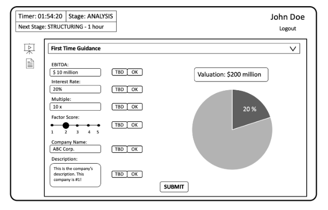
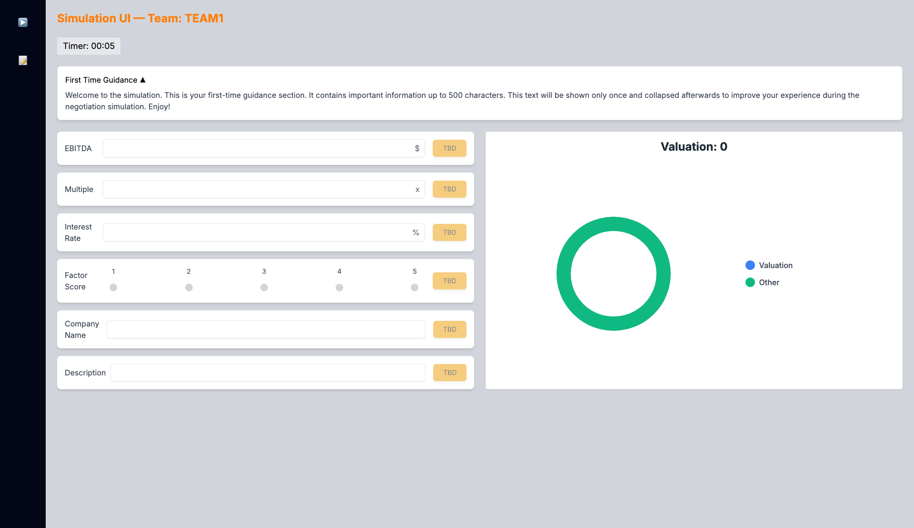
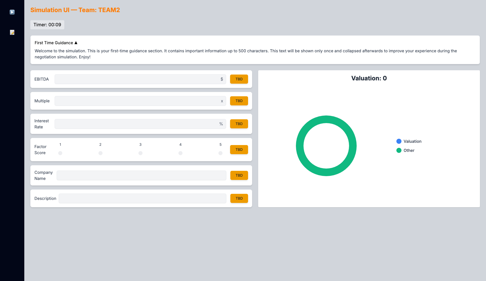
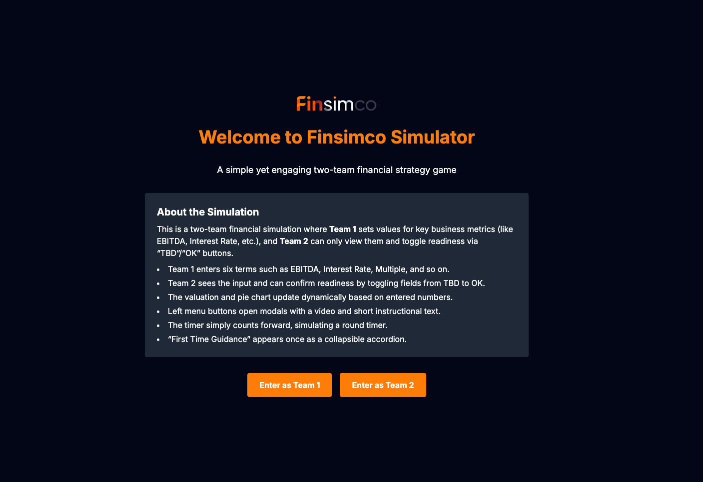
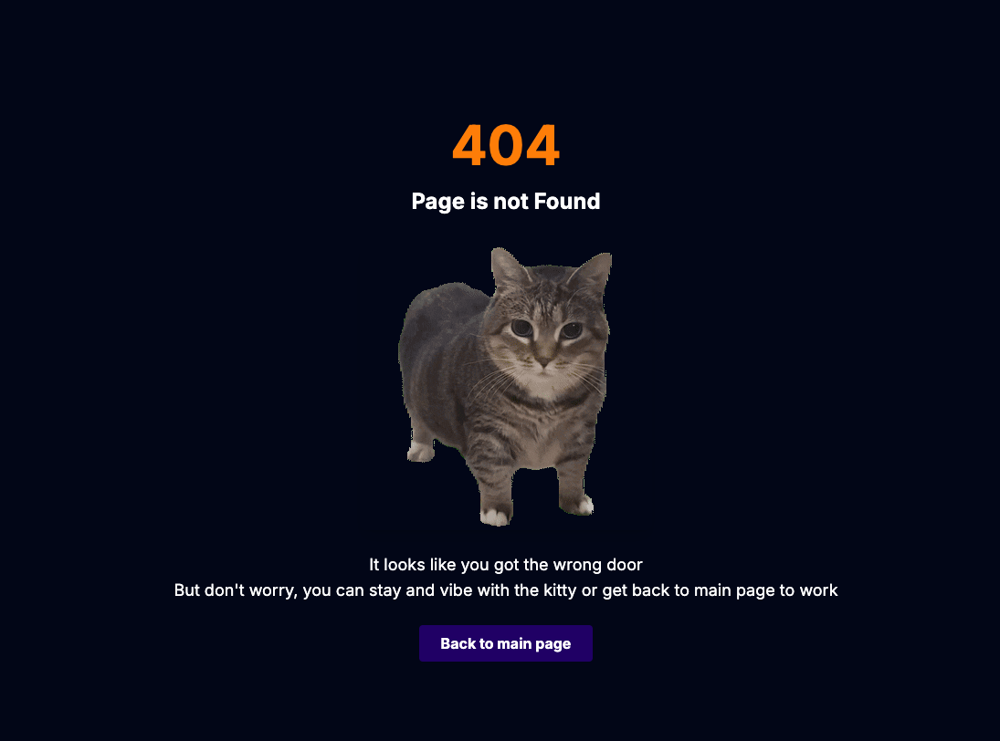

# FinSimCo Frontend Test

## 📜 Technical Specification (Frontend)

Below is a draft of the UI for a basic simulation. It is based on a simple simulation game where two teams negotiate on a few terms. Team 1 (the one in the draft interface below) inputs the term values, while Team 2 can only see these values on their screen. Your task is to implement this into a functional interface using a component-based architecture, while applying your own design and UX principles. Please note that the design aspect of this task is crucial. Focus most of your effort on creating a visually appealing and user-friendly design.
- Data Storage: No need to store data for this simulation. You can mock the data for the sake of the UI. There is no need for actual communication between teams.
- Layout Flexibility: The layout in the draft is a guideline, not a rigid requirement. If altering it improves the UI/UX, feel free to adjust it.
- Sidebar Interaction: Left-side menu buttons should trigger large modal windows. The top one shows a video and the one below that shows 500 characters of text.
- Timer Functionality: The timer should be a simple counter that ticks forward.
- First-Time Guidance: The "First Time Guidance" section should be an accordion-style dropdown containing up to 500 characters of text. This text will be displayed only the first time, then remain collapsed for future sessions.
- Input Fields: The six input fields must be functional and easy to interact with.
- Dynamic Values: Modifying the EBITDA, Multiple or interest rate should dynamically adjust the corresponding Valuation and Pie Chart value on the right side of the interface. The Valuation formula is: ( EBITDA x Multiple x Factor Score).
- Input Toggle: Each input field has a "TBD" and "OK" toggle. Only Team 1 is allowed to modify the input values, while only Team 2 can toggle between "TBD" and "OK."

### UI-Example



## 🛠️ Technologies

- React + Vite
- Tailwind CSS for styling
- Zustand for state management
- broadcast-channel to connect data in all tabs so both teams can work the same time
- Node v.18.20.8
- Recharts for Pie Chart

## Structure

### Team 1

### Team 2

### Main Page

### Error 404



## 🚀 How to Run the Project

```bash
# Install dependencies
npm install

# Start development server
npm run dev

# To access table for TEAM 1 use this adress 
http://localhost:5173/team/team1

# To access table for TEAM 2 use this adress
http://localhost:5173/team/team2